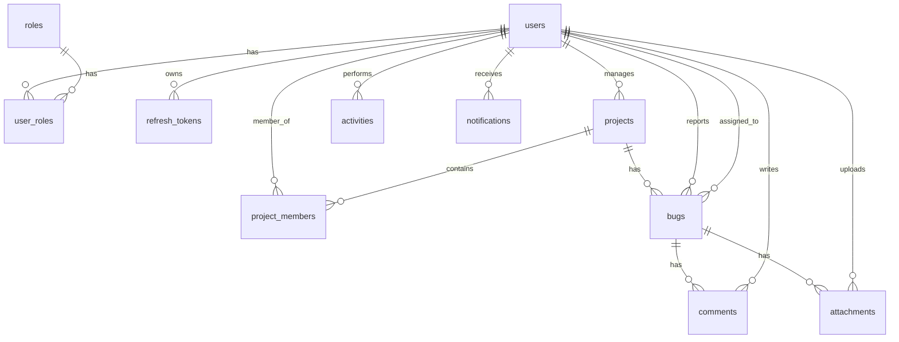

# Enterprise Bug Tracking System

A production-ready, highly secure, and enterprise-grade Bug Tracking System built with a FastAPI (Python 3.12) backend and MySQL database. Follows clean architecture, SOLID design principles, and includes standard security controls like JWT authentication with rotation and role-based access control (RBAC).

---

## Technical Architecture

The backend codebase follows clean architecture principles with a strict separation of concerns:

- **Routers/Controllers**: HTTP handlers and endpoint routing. Keep thin, rely on dependency injection.
- **Services (Domain Logic)**: Core business rules, validation constraints (such as the bug workflow transition engine), and notification dispatchers.
- **Repositories (Data Access)**: Queries to MySQL database via SQLAlchemy ORM. Keeps data-access logic decoupled from business services.
- **Models**: Database entity declarations mapping SQLAlchemy objects to MySQL schemas.
- **Schemas**: Request/response serialization and input rules enforced by Pydantic.

```
backend/
├── app/
│   ├── core/
│   │   ├── config.py         # Application settings (Pydantic-Settings)
│   │   └── security.py       # Bcrypt password hashing & JWT handlers
│   ├── database/
│   │   └── session.py        # SQLAlchemy engine & session generators
│   ├── middleware/
│   │   └── error_handler.py  # Global exception interceptor
│   ├── models/
│   │   ├── base.py           # Declarative base class
│   │   └── models.py         # SQLAlchemy DB models (Users, Projects, Bugs, Comments, etc.)
│   ├── schemas/
│   │   ├── auth.py           # Authentication serialization (registration strength check)
│   │   ├── user.py           # Admin user CRUD schemas
│   │   ├── project.py        # Project schemas
│   │   ├── bug.py            # Bug schemas & priorities/severities enums
│   │   └── comment.py        # Comments schemas
│   ├── repositories/
│   │   ├── auth_repository.py
│   │   ├── user_repository.py
│   │   ├── project_repository.py
│   │   └── bug_repository.py
│   ├── services/
│   │   ├── auth_service.py   # Token generation, session rotation, registration
│   │   ├── user_service.py   # Admin management commands
│   │   ├── project_service.py# Project dates & manager validation
│   │   ├── bug_service.py    # Workflow transition engine & attachments file-checking
│   │   ├── activity_service.py# Activity audits logger
│   │   └── notification_service.py # Mock email & DB alerts
│   ├── routers/
│   │   ├── deps.py           # Current user login & RoleChecker RBAC guards
│   │   ├── auth.py
│   │   ├── users.py
│   │   ├── projects.py
│   │   ├── bugs.py
│   │   └── comments.py
│   └── main.py               # Application entrypoint
├── tests/
│   ├── conftest.py          # Pytest fixtures, mock DB configuration
│   ├── test_auth.py          # Hashing, token expiration, rotation tests
│   ├── test_users_projects.py# Admin guards and project PM validations
│   └── test_bugs.py          # Workflow transition checks, comments, upload limits
├── requirements.txt          # Python dependencies
└── .gitignore
```

---

## Database ER Diagram Schema

The MySQL database schema is normalized and contains foreign keys, cascading deletions, and indexes on lookup fields:



### Roles and RBAC Matrix
The system seeds four primary roles:
1. **Admin**: Complete system-wide control (manage users, delete projects, override bug states).
2. **Project Manager**: Create/edit projects, allocate members, manage bugs.
3. **Developer**: View projects, assign bugs to themselves, transition bug states (Assigned ➔ In Progress ➔ Testing).
4. **Tester**: Report bugs, write comments, transition bug states (Testing ➔ Resolved/Reopened ➔ Closed).

---

## API Documentation

### Authentication
- `POST /api/v1/auth/register` - Create user. The first user bootstraps to **Admin**; subsequent register as **Developer**.
- `POST /api/v1/auth/login` - Authenticate credentials, returns access & refresh tokens.
- `POST /api/v1/auth/refresh` - Rotate tokens (old refresh token is invalidated upon rotation).
- `POST /api/v1/auth/logout` - Revoke refresh token session.
- `GET /api/v1/auth/profile` - Get current active profile details.

### Users (Admin Only)
- `GET /api/v1/users` - List all users.
- `POST /api/v1/users` - Create a user with explicit roles.
- `GET /api/v1/users/{id}` - Details of a user.
- `PUT /api/v1/users/{id}` - Update name, email, roles, activation state.
- `DELETE /api/v1/users/{id}` - Delete a user account (prevents self-deletion).

### Projects (Read: All, Write: Admin/PM)
- `GET /api/v1/projects` - List all projects.
- `POST /api/v1/projects` - Create project (verifies start/end dates, manager role).
- `GET /api/v1/projects/{id}` - Project details with manager and members list.
- `PUT /api/v1/projects/{id}` - Edit details or membership sync.
- `DELETE /api/v1/projects/{id}` - Delete project.

### Bugs (All Logged In Users)
- `GET /api/v1/bugs` - Search, filter, page, and sort bugs.
  - *Query Params*: `search`, `status`, `priority`, `severity`, `project_id`, `assignee_id`, `skip`, `limit`, `sort_by`, `sort_desc`.
- `POST /api/v1/bugs` - File a new bug (defaults to `New` status).
- `GET /api/v1/bugs/{id}` - Retrieve details, attachments list, and assignee mappings.
- `PUT /api/v1/bugs/{id}` - Update title, priority, assignee, or status (validates transition workflow matrix).
- `DELETE /api/v1/bugs/{id}` - Delete bug and remove disk attachments.

### Attachments & Comments
- `POST /api/v1/bugs/{id}/attachments` - Upload file (screenshot/log/zip). Max 5MB limit, validates allowed formats.
- `DELETE /api/v1/bugs/attachments/{id}` - Remove attachment (restricted to uploader, PM, Admin).
- `POST /api/v1/comments` - Create comment. Mentions like `@username` notify that user.
- `GET /api/v1/comments/{bugId}` - Get comment thread.
- `PUT /api/v1/comments/{commentId}` - Edit comment.
- `DELETE /api/v1/comments/{commentId}` - Delete comment.

---

## Local Setup & Execution

### 1. Requirements
Ensure Python 3.12+ is installed on your local machine.

### 2. Local Installation
Navigate to the `backend/` directory:
```bash
# Create virtual environment
python -m venv venv

# Activate on Windows
venv\Scripts\activate
# Activate on Unix/Mac
source venv/bin/activate

# Install dependencies
pip install -r requirements.txt
```

### 3. Run Development Server
Run `uvicorn` local server. Database defaults to SQLite for simple local evaluation:
```bash
# Set PYTHONPATH and start uvicorn
uvicorn app.main:app --reload
```
API Documentation will be available locally at `http://127.0.0.1:8000/docs`.

### 4. Running Test Suite
Execute tests with `pytest` using the active virtual environment:
```bash
python -m pytest
```
All test configurations are located in `tests/conftest.py` using SQLite in-memory databases for isolated execution.
